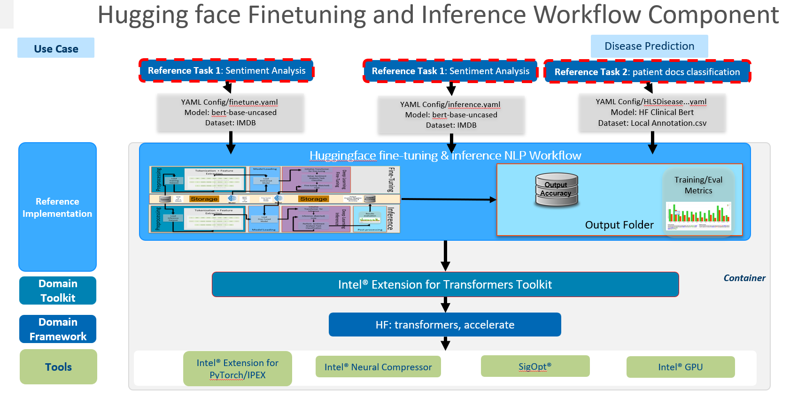

# HuggingFace Finetune and Inference

## Introduction
Learn to use Intel's XPU hardware and Intel optimized software for Finetuning and running inference on Hugging Face models for tasks related to Natural Language Processing (NLP) with easy to run steps that seemlessly leverage intel Optimizations for Xeon CPU processors using Intel Extension for Tranfomrer Domain toolkit, PyTorch* and Intel® Neural Compressor. 

Bring in most datasets from Hugging Face or specify your local dataset supporting your specific use case.


## Solution Technical Overview

The Huggingface Finetuning(transfer learning) and Inference workflow demonstrates NLP(natural language processing) workflows/pipelines using hugginface transfomer API to be run along with intel optimised software represented using toolkits, domainkits, packages, frameworks and other libraries for effective use of intel hardware leveraging Intel's AI instructions for fast processing and increased performance.The  workflows can be easily used by applications or reference kits showcasing usage. 

The workflow currenly supports
```
Huggingface NLP Finetuning / Transfer Learning
Huggingface NLP Inference
```
The HF Finetuning and Inference workflow supports the following API
```
Huggingface Transformer's (trainer API)
Intel's extension for Transformers API (Itrex API) also named ( Intel's Transformer/NLP Toolkit)
```

## Validated Hardware Details
| Supported Hardware           | Precision  |
| ---------------------------- | ---------- |
| CPU|FP32, BF16 |
| GPU|FP32, TF32, FP16 |

## How it Works
### Architecture


## Get Started
### Clone this Repository
```
git clone current repository
cd into the current repository directory
```

### Create a New Python  (Conda or Venv) Environment With Env Name: "hfftinf_wf"
```shell
conda create -n hfftinf_wf python=3.9
conda activate hfftinf_wf
```
or
```shell
python -m venv hfftinf_wf
source hfftinf_wf/bin/activate
```

### Install Packages For Running hf-finetuning-inference-nlp-workflows
```shell
pip install -r requirements.txt
```

## Run Using Bare Metal 
See [config/README.md](./config/README.md) for options.
```shell
python src/run.py --config_file config/finetune.yaml 
python src/run.py --config_file config/inference.yaml 
```

## Run Using Docker

### 1. Set Up Docker Engine And Docker Compose
You'll need to install Docker Engine on your development system. Note that while **Docker Engine** is free to use, **Docker Desktop** may require you to purchase a license. See the [Docker Engine Server installation instructions](https://docs.docker.com/engine/install/#server) for details.


To build and run this workload inside a Docker Container, ensure you have Docker Compose installed on your machine. If you don't have this tool installed, consult the official [Docker Compose installation documentation](https://docs.docker.com/compose/install/linux/#install-the-plugin-manually).


```bash
DOCKER_CONFIG=${DOCKER_CONFIG:-$HOME/.docker}
mkdir -p $DOCKER_CONFIG/cli-plugins
curl -SL https://github.com/docker/compose/releases/download/v2.7.0/docker-compose-linux-x86_64 -o $DOCKER_CONFIG/cli-plugins/docker-compose
chmod +x $DOCKER_CONFIG/cli-plugins/docker-compose
docker compose version
```

### 2. Set Up Docker Image
Build or Pull the provided docker image.

```bash
git submodule update --init --recursive
cd docker
docker compose build
```
OR
```bash
docker pull intel/ai-workflows:beta-hf-nlp-disease-prediction
```

### 3. Run With Docker Compose

```mermaid
%%{init: {'theme': 'dark'}}%%
flowchart RL
  Vconfig{{../config}} x-. /workspace/config .-x dev
  Voutput{{./output}} x-. /workspace/output .-x dev

  classDef volumes fill:#0f544e,stroke:#23968b
  class Vconfig,Voutput volumes
```

```bash
cd docker
export CONFIG=<config_file_name_without_.yaml>
docker compose run dev
```

| Environment Variable Name | Default Value | Description |
| --- | --- | --- |
| CONFIG | n/a | Config file name |

### 4. Clean Up Docker Container
Stop container created by docker compose and remove it.

```bash
docker compose down
```

## Expected Output

Post completion of finetuning, the following output will be presented in the console:
1. Training Performance
2. Location of Saved Model
3. Prediction Result

Example :-
```
{'train_runtime': 363.0564, 'train_samples_per_second': 68.86, 'train_steps_per_second': 0.689, 'train_loss': 0.4555707092285156, 'epoch': 1.0}

Configuration saved in ./output_dir/config.json
Model weights saved in ./output_dir/pytorch_model.bin
tokenizer config file saved in ./output_dir/tokenizer_config.json
Special tokens file saved in ./output_dir/special_tokens_map.json

*********** TEST_METRICS ***********
Accuracy: 0.81976
```
  
## Summary and Next Steps

You can try other tasks, models and datasets from huggingface repository per your liking by changing the config file.
  
## Learn More

For more information and additional workflows using this domain toolkit [here](../../workflows/)

For more information about addtional workflows or to read about other relevant workflow
examples, see these guides and software resources:

- Put ref links and descriptions here, for example
- [Intel® AI Analytics Toolkit (AI Kit)](https://www.intel.com/content/www/us/en/developer/tools/oneapi/ai-analytics-toolkit.html)
- [Azure Machine Learning Documentation](https://learn.microsoft.com/en-us/azure/machine-learning/)
- links to other similar or related items from the dev catalog


## Troubleshooting

1. If in the config file the parameter for dataset: "local" but no local_dataset parameters is passed then the below exception is thrown. Either pass the loacal_dataset parameters or provide any other huggingface dataset.
```
Traceback (most recent call last):
  File "/DataDisk_4/frameworks.ai.nlp-toolkit.intel-nlp-toolkit/workflows/hf_finetuning_and_inference_nlp/src/run.py", line 76, in <module>
    main()
  File "/DataDisk_4/frameworks.ai.nlp-toolkit.intel-nlp-toolkit/workflows/hf_finetuning_and_inference_nlp/src/run.py", line 58, in main
    finetune.e2e_finetune()
  File "/DataDisk_4/frameworks.ai.nlp-toolkit.intel-nlp-toolkit/workflows/hf_finetuning_and_inference_nlp/src/finetune.py", line 40, in e2e_finetune
    self._load_data()
  File "/DataDisk_4/frameworks.ai.nlp-toolkit.intel-nlp-toolkit/workflows/hf_finetuning_and_inference_nlp/src/finetune_itrex.py", line 42, in _load_data
    return super()._load_data()
  File "/DataDisk_4/frameworks.ai.nlp-toolkit.intel-nlp-toolkit/workflows/hf_finetuning_and_inference_nlp/src/finetune.py", line 53, in _load_data
    dataset_cfg = self.args.local_dataset
AttributeError: 'Namespace' object has no attribute 'local_dataset'
```

2. If dataset or model chosen is chosen is not suitable for task the below exception will be seen. Provide suitable dataset to fix it.
```
Traceback (most recent call last):
  File "/DataDisk_4/frameworks.ai.nlp-toolkit.intel-nlp-toolkit/workflows/hf_finetuning_and_inference_nlp/src/run.py", line 76, in <module>
    main()
  File "/DataDisk_4/frameworks.ai.nlp-toolkit.intel-nlp-toolkit/workflows/hf_finetuning_and_inference_nlp/src/run.py", line 58, in main
    finetune.e2e_finetune()
  File "/DataDisk_4/frameworks.ai.nlp-toolkit.intel-nlp-toolkit/workflows/hf_finetuning_and_inference_nlp/src/finetune.py", line 43, in e2e_finetune
    self._do_finetune()
  File "/DataDisk_4/frameworks.ai.nlp-toolkit.intel-nlp-toolkit/workflows/hf_finetuning_and_inference_nlp/src/finetune_itrex.py", line 65, in _do_finetune
    train_result = self.trainer.train()
  File "/DataDisk_4/hfftinf_wf/lib/python3.9/site-packages/intel_extension_for_transformers/optimization/trainer.py", line 928, in train
    tr_loss_step = training_step(model, inputs)
  File "/DataDisk_4/hfftinf_wf/lib/python3.9/site-packages/intel_extension_for_transformers/optimization/trainer.py", line 1148, in training_step
    loss = self.compute_loss(model, inputs)
  File "/DataDisk_4/hfftinf_wf/lib/python3.9/site-packages/intel_extension_for_transformers/optimization/trainer.py", line 1462, in compute_loss
    loss = outputs["loss"] if isinstance(outputs, dict) else outputs[0]
  File "/DataDisk_4/hfftinf_wf/lib/python3.9/site-packages/transformers/utils/generic.py", line 289, in __getitem__
    return inner_dict[k]
KeyError: 'loss'
```


## Support

The Workflow team tracks both bugs and enhancement requests using GitHub issues.

Before submitting a suggestion or bug report, search the GitHub issues to see if your issue has already been reported.